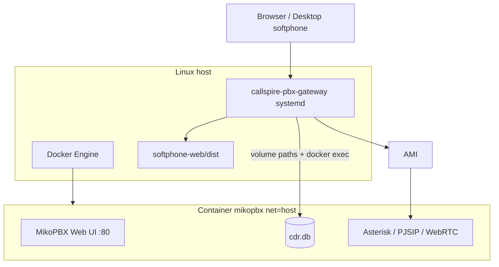

# Architecture

## Why gateway runs on the host (not in Docker)

MikoPBX official image uses **`--net=host`**. The gateway needs:

- Read **`cdr.db`** and **`mikopbx.db`** from Docker volumes on the host
- **`docker exec`** / **`docker cp`** into container `mikopbx`
- AMI TCP to localhost (Asterisk inside MikoPBX)
- Optional: read **`pjsip.conf`** from the container for WebRTC SIP secrets

Running the gateway on the **same Linux host** is the supported model today.

## Stack diagram



## Install order

1. **preflight** — root, Docker, `www-user`, git
2. **MikoPBX** — `docker compose -f compose/mikopbx.yml up -d`, pull `:latest`
3. **Gateway + web softphone + Kommo** — rsync from this repo to `/opt/callspire`, venv, `/etc/callspire/config.yaml`, systemd
4. **AMI** — optional auto-config for Originate
5. **verify** — curl health endpoints

Install entry points:

- **git clone:** [Callspire.Gateway-for-MikoPBX](https://github.com/Intteger157/Callspire.Gateway-for-MikoPBX)
- **curl:** `https://raw.githubusercontent.com/Intteger157/Callspire.Gateway-for-MikoPBX/main/install.sh`

Curl mode clones the same repository to `/opt/callspire/stack-src` before running the steps above.

## MikoPBX version

Installer uses **`mikopbx/mikopbx:latest`** (currently tracks newest stable on Docker Hub / GHCR).  
Pin explicitly:

```bash
MIKOPBX_IMAGE=mikopbx/mikopbx:2026.2.118
```

## Post-install (manual)

1. Open MikoPBX wizard — set admin password, extensions, trunks
2. Gateway admin `/admin` — AMI, WebRTC WSS URL, app users
3. Optional dialplans from Callspire docs (`telnyx-preserve-plus-e164`, WebRTC originate fix)
4. **nginx** + Let's Encrypt in front of gateway port
5. Set `SESSION_SECURE=true` when using HTTPS

## nginx sketch

```nginx
server {
  listen 443 ssl http2;
  server_name pbx.example.com;

  location / {
    proxy_pass http://127.0.0.1:8443;
    proxy_set_header Host $host;
    proxy_set_header X-Forwarded-Proto $scheme;
    proxy_set_header X-Forwarded-For $proxy_add_x_forwarded_for;
  }
}
```

## Future: gateway in Docker

Gateway + web softphone may later ship as a single Docker image (see project discussions). MikoPBX will remain a separate container with host networking.
